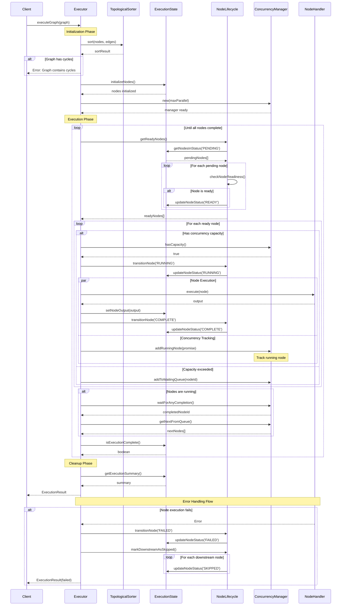
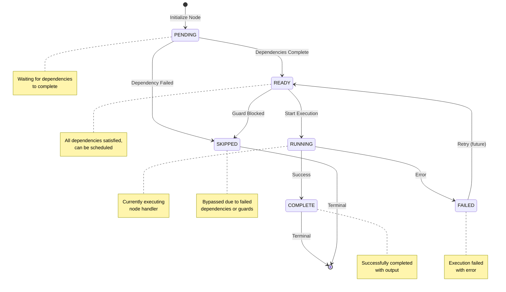
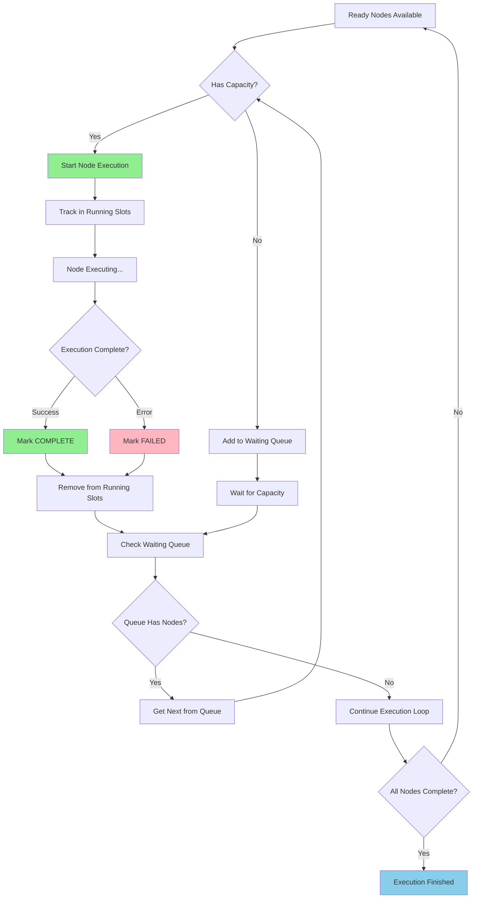

# Execution Flow Sequence Diagram

```mermaid
sequenceDiagram
    participant Client
    participant Executor
    participant TopologicalSorter
    participant ExecutionState
    participant NodeLifecycle
    participant ConcurrencyManager
    participant NodeHandler

    Client->>Executor: executeGraph(graph)
    
    Note over Executor: Initialization Phase
    Executor->>TopologicalSorter: sort(nodes, edges)
    TopologicalSorter-->>Executor: sortResult
    
    alt Graph has cycles
        Executor-->>Client: Error: Graph contains cycles
    end
    
    Executor->>ExecutionState: initializeNodes()
    ExecutionState-->>Executor: nodes initialized
    
    Executor->>ConcurrencyManager: new(maxParallel)
    ConcurrencyManager-->>Executor: manager ready
    
    Note over Executor: Execution Phase
    loop Until all nodes complete
        Executor->>NodeLifecycle: getReadyNodes()
        NodeLifecycle->>ExecutionState: getNodesInStatus('PENDING')
        ExecutionState-->>NodeLifecycle: pendingNodes[]
        
        loop For each pending node
            NodeLifecycle->>NodeLifecycle: checkNodeReadiness()
            alt Node is ready
                NodeLifecycle->>ExecutionState: updateNodeStatus('READY')
            end
        end
        
        NodeLifecycle-->>Executor: readyNodes[]
        
        loop For each ready node
            alt Has concurrency capacity
                Executor->>ConcurrencyManager: hasCapacity()
                ConcurrencyManager-->>Executor: true
                
                Executor->>NodeLifecycle: transitionNode('RUNNING')
                NodeLifecycle->>ExecutionState: updateNodeStatus('RUNNING')
                
                par Node Execution
                    Executor->>NodeHandler: execute(node)
                    NodeHandler-->>Executor: output
                    
                    Executor->>ExecutionState: setNodeOutput(output)
                    Executor->>NodeLifecycle: transitionNode('COMPLETE')
                    NodeLifecycle->>ExecutionState: updateNodeStatus('COMPLETE')
                and Concurrency Tracking
                    Executor->>ConcurrencyManager: addRunningNode(promise)
                    Note over ConcurrencyManager: Track running node
                end
                
            else Capacity exceeded
                Executor->>ConcurrencyManager: addToWaitingQueue(nodeId)
            end
        end
        
        alt Nodes are running
            Executor->>ConcurrencyManager: waitForAnyCompletion()
            ConcurrencyManager-->>Executor: completedNodeId
            
            Executor->>ConcurrencyManager: getNextFromQueue()
            ConcurrencyManager-->>Executor: nextNodes[]
        end
        
        Executor->>ExecutionState: isExecutionComplete()
        ExecutionState-->>Executor: boolean
    end
    
    Note over Executor: Cleanup Phase
    Executor->>ExecutionState: getExecutionSummary()
    ExecutionState-->>Executor: summary
    
    Executor-->>Client: ExecutionResult

    Note over Executor,NodeHandler: Error Handling Flow
    alt Node execution fails
        NodeHandler-->>Executor: Error
        Executor->>NodeLifecycle: transitionNode('FAILED')
        NodeLifecycle->>ExecutionState: updateNodeStatus('FAILED')
        Executor->>NodeLifecycle: markDownstreamAsSkipped()
        
        loop For each downstream node
            NodeLifecycle->>ExecutionState: updateNodeStatus('SKIPPED')
        end
        
        Executor-->>Client: ExecutionResult(failed)
    end
```

## State Transition Diagram

```mermaid
stateDiagram-v2
    [*] --> PENDING: Initialize Node
    
    PENDING --> READY: Dependencies Complete
    PENDING --> SKIPPED: Dependency Failed
    
    READY --> RUNNING: Start Execution
    READY --> SKIPPED: Guard Blocked
    
    RUNNING --> COMPLETE: Success
    RUNNING --> FAILED: Error
    
    FAILED --> READY: Retry (future)
    
    COMPLETE --> [*]: Terminal
    SKIPPED --> [*]: Terminal
    
    note right of PENDING
        Waiting for dependencies
        to complete
    end note
    
    note right of READY
        All dependencies satisfied,
        can be scheduled
    end note
    
    note right of RUNNING
        Currently executing
        node handler
    end note
    
    note right of COMPLETE
        Successfully completed
        with output
    end note
    
    note right of FAILED
        Execution failed
        with error
    end note
    
    note right of SKIPPED
        Bypassed due to failed
        dependencies or guards
    end note
```

## Concurrency Flow Diagram

```mermaid
flowchart TD
    A[Ready Nodes Available] --> B{Has Capacity?}
    B -->|Yes| C[Start Node Execution]
    B -->|No| D[Add to Waiting Queue]
    
    C --> E[Track in Running Slots]
    E --> F[Node Executing...]
    
    F --> G{Execution Complete?}
    G -->|Success| H[Mark COMPLETE]
    G -->|Error| I[Mark FAILED]
    
    H --> J[Remove from Running Slots]
    I --> J
    J --> K[Check Waiting Queue]
    
    K --> L{Queue Has Nodes?}
    L -->|Yes| M[Get Next from Queue]
    L -->|No| N[Continue Execution Loop]
    
    M --> B
    N --> O{All Nodes Complete?}
    O -->|No| A
    O -->|Yes| P[Execution Finished]
    
    D --> Q[Wait for Capacity]
    Q --> K
    
    style C fill:#90EE90
    style H fill:#90EE90
    style I fill:#FFB6C1
    style P fill:#87CEEB
``` 