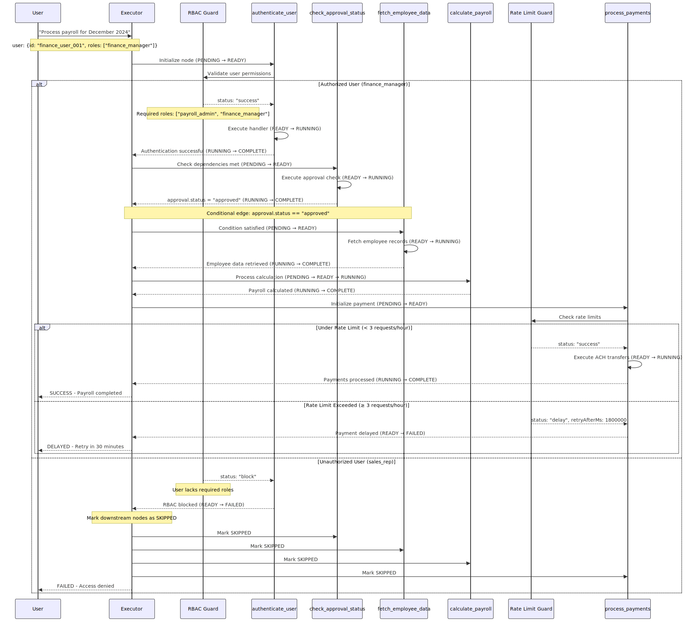

# Payroll Processing Walkthrough

## Overview

This walkthrough demonstrates the complete execution of the payroll-processing intent graph, showcasing all v0.1 features including RBAC guards, rate limiting, conditional edges, and error propagation.

## Execution Flow Diagram



## Scenario 1: Successful Execution (Happy Path)

### Initial Request
```
Natural Language: "Process payroll for December 2024"
User Context: { id: "finance_user_001", roles: ["finance_manager"], permissions: ["payroll:read", "payroll:write"] }
```

### Step-by-Step Execution

#### 1. Graph Initialization
```
[2024-01-15 14:30:00] INFO: Execution started - graph: payroll-processing, nodes: 5
[2024-01-15 14:30:00] INFO: Configuration loaded - maxParallel=2, timeout=300s
[2024-01-15 14:30:00] INFO: Initializing nodes: [authenticate_user, check_approval_status, fetch_employee_data, calculate_payroll, process_payments]
```

#### 2. Node: authenticate_user (Entry Point)
```
[2024-01-15 14:30:00] INFO: Node ready - authenticate_user
[2024-01-15 14:30:00] INFO: RBAC guard evaluating - user: finance_user_001, required_roles: [payroll_admin, finance_manager]
[2024-01-15 14:30:00] INFO: RBAC guard passed - user has role: finance_manager
[2024-01-15 14:30:00] INFO: Node running - authenticate_user
[2024-01-15 14:30:01] INFO: Node complete - authenticate_user, duration: 1000ms
```

**Output:**
```json
{
  "success": true,
  "user": {
    "id": "finance_user_001",
    "roles": ["finance_manager"],
    "authenticated_at": "2024-01-15T14:30:01Z"
  }
}
```

#### 3. Node: check_approval_status
```
[2024-01-15 14:30:01] INFO: Node ready - check_approval_status  
[2024-01-15 14:30:01] INFO: Node running - check_approval_status
[2024-01-15 14:30:02] INFO: Approval status verified - period: 2024-12, status: approved
[2024-01-15 14:30:02] INFO: Node complete - check_approval_status, duration: 1000ms
```

**Output:**
```json
{
  "approval": {
    "status": "approved",
    "period": "2024-12",
    "approved_by": "hr_director_003",
    "approved_at": "2024-01-10T09:15:00Z"
  }
}
```

#### 4. Conditional Edge Evaluation
```
[2024-01-15 14:30:02] INFO: Evaluating conditional edge - approval_to_data
[2024-01-15 14:30:02] INFO: Condition met - approval.status == "approved" 
[2024-01-15 14:30:02] INFO: Node ready - fetch_employee_data
```

#### 5. Node: fetch_employee_data
```
[2024-01-15 14:30:02] INFO: Node running - fetch_employee_data
[2024-01-15 14:30:04] INFO: Employee data retrieved - count: 245, active: 240
[2024-01-15 14:30:04] INFO: Node complete - fetch_employee_data, duration: 2000ms
```

**Output:**
```json
{
  "employees": [
    {
      "id": "emp_001",
      "name": "John Doe", 
      "salary": 75000,
      "department": "Engineering",
      "status": "active"
    },
    {
      "id": "emp_002",
      "name": "Jane Smith",
      "salary": 85000,
      "department": "Finance", 
      "status": "active"
    }
  ],
  "summary": {
    "total_employees": 245,
    "active_employees": 240,
    "total_salary": 18600000
  }
}
```

#### 6. Node: calculate_payroll
```
[2024-01-15 14:30:04] INFO: Node ready - calculate_payroll
[2024-01-15 14:30:04] INFO: Node running - calculate_payroll
[2024-01-15 14:30:08] INFO: Payroll calculations complete - gross: $18,600,000, deductions: $4,650,000, net: $13,950,000
[2024-01-15 14:30:08] INFO: Node complete - calculate_payroll, duration: 4000ms
```

**Output:**
```json
{
  "period": "2024-12",
  "summary": {
    "total_gross": 18600000,
    "total_deductions": 4650000,
    "total_net": 13950000,
    "employee_count": 240
  },
  "breakdown": {
    "federal_tax": 2790000,
    "state_tax": 930000, 
    "social_security": 465000,
    "medicare": 108600,
    "health_insurance": 240000,
    "retirement_401k": 116400
  }
}
```

#### 7. Node: process_payments (Rate Limited)
```
[2024-01-15 14:30:08] INFO: Node ready - process_payments
[2024-01-15 14:30:08] INFO: Rate limit guard evaluating - user: finance_user_001, window: 1h
[2024-01-15 14:30:08] INFO: Rate limit check passed - requests in window: 0/3
[2024-01-15 14:30:08] INFO: Node running - process_payments
[2024-01-15 14:30:15] INFO: ACH transfers initiated - batch_id: batch_20240115_143008
[2024-01-15 14:30:15] INFO: Node complete - process_payments, duration: 7000ms
```

**Output:**
```json
{
  "batch_id": "batch_20240115_143008",
  "transaction_count": 240,
  "total_amount": 13950000,
  "status": "completed",
  "ach_reference": "ACH_REF_20240115_143015",
  "completion_time": "2024-01-15T14:30:15Z"
}
```

#### 8. Execution Summary
```
[2024-01-15 14:30:15] INFO: Execution complete - duration: 15000ms, success: 5, failed: 0
[2024-01-15 14:30:15] INFO: Final status: SUCCESS
```

**Final Result:**
```json
{
  "status": "SUCCESS",
  "execution_time": 15000,
  "nodes_completed": 5,
  "total_payroll": 13950000,
  "batch_reference": "batch_20240115_143008"
}
```

---

## Scenario 2: RBAC Guard Failure

### Initial Request
```
Natural Language: "Process payroll for December 2024"
User Context: { id: "sales_rep_005", roles: ["sales_rep"], permissions: ["crm:read"] }
```

### Execution Log
```
[2024-01-15 14:45:00] INFO: Execution started - graph: payroll-processing, nodes: 5
[2024-01-15 14:45:00] INFO: Node ready - authenticate_user
[2024-01-15 14:45:00] INFO: RBAC guard evaluating - user: sales_rep_005, required_roles: [payroll_admin, finance_manager]
[2024-01-15 14:45:00] ERROR: RBAC guard blocked - user lacks required roles
[2024-01-15 14:45:00] ERROR: Node failed - authenticate_user, error: Access denied
[2024-01-15 14:45:00] INFO: Marking downstream nodes as SKIPPED
[2024-01-15 14:45:00] INFO: Node skipped - check_approval_status
[2024-01-15 14:45:00] INFO: Node skipped - fetch_employee_data
[2024-01-15 14:45:00] INFO: Node skipped - calculate_payroll
[2024-01-15 14:45:00] INFO: Node skipped - process_payments
[2024-01-15 14:45:00] ERROR: Execution failed - duration: 500ms, success: 0, failed: 1, skipped: 4
```

**Final Result:**
```json
{
  "status": "FAILED",
  "error": "RBAC guard blocked: User lacks required roles [payroll_admin, finance_manager]",
  "failed_node": "authenticate_user",
  "execution_time": 500
}
```

---

## Scenario 3: Rate Limit Exceeded

### Initial Setup
User `finance_user_001` has already processed payroll 3 times in the current hour window.

### Fourth Request
```
Natural Language: "Process payroll for December 2024" (4th attempt)
User Context: { id: "finance_user_001", roles: ["finance_manager"], permissions: ["payroll:read", "payroll:write"] }
```

### Execution Log
```
[2024-01-15 15:15:00] INFO: Execution started - graph: payroll-processing, nodes: 5
[2024-01-15 15:15:01] INFO: Node complete - authenticate_user, duration: 1000ms
[2024-01-15 15:15:02] INFO: Node complete - check_approval_status, duration: 1000ms  
[2024-01-15 15:15:04] INFO: Node complete - fetch_employee_data, duration: 2000ms
[2024-01-15 15:15:08] INFO: Node complete - calculate_payroll, duration: 4000ms
[2024-01-15 15:15:08] INFO: Node ready - process_payments
[2024-01-15 15:15:08] INFO: Rate limit guard evaluating - user: finance_user_001, window: 1h
[2024-01-15 15:15:08] WARN: Rate limit exceeded - requests in window: 3/3
[2024-01-15 15:15:08] ERROR: Node failed - process_payments, error: Rate limit exceeded
[2024-01-15 15:15:08] INFO: Execution complete - duration: 8500ms, success: 4, failed: 1
```

**Final Result:**
```json
{
  "status": "FAILED", 
  "error": "Rate limit exceeded: max 3 requests per hour",
  "failed_node": "process_payments",
  "retry_after_ms": 1800000,
  "retry_at": "2024-01-15T15:45:08Z",
  "execution_time": 8500,
  "partial_results": {
    "payroll_calculated": true,
    "amount_ready": 13950000,
    "employees_processed": 240
  }
}
```

---

## Configuration Details

### Concurrency Limits
- **maxParallel**: 2 nodes can execute simultaneously
- **Observed behavior**: `fetch_employee_data` and other independent nodes respect this limit

### Timeout Settings  
- **Global timeout**: 300 seconds (5 minutes)
- **Node-level timeouts**: Vary by operation complexity
  - Authentication: 30s
  - Data fetching: 45s  
  - Calculations: 60s
  - Payment processing: 90s

### Guard Configurations

#### RBAC Guard
```yaml
name: "payroll_rbac_guard"
type: "rbac"
apply_to:
  nodes: ["authenticate_user"]
config:
  requiredRoles: ["payroll_admin", "finance_manager"]
  requiredPermissions: ["payroll:read", "payroll:write"]
  allowSuperuser: false
```

#### Rate Limit Guard
```yaml
name: "payment_rate_limit_guard"
type: "rate_limit"
apply_to:
  nodes: ["process_payments"]
config:
  maxRequests: 3
  windowMs: 3600000  # 1 hour
  keyGenerator: "user"
```

## Troubleshooting

### Common Issues

1. **RBAC Failures**
   - **Symptom**: Execution fails immediately at `authenticate_user`
   - **Cause**: User lacks required roles or permissions
   - **Solution**: Ensure user has `payroll_admin` OR `finance_manager` role

2. **Rate Limit Exceeded**
   - **Symptom**: Execution succeeds until `process_payments`, then fails
   - **Cause**: User has exceeded 3 payroll runs per hour
   - **Solution**: Wait for window to reset or contact administrator

3. **Approval Failures**
   - **Symptom**: Execution stops after `check_approval_status`
   - **Cause**: Pay period not approved or approval expired
   - **Solution**: Obtain proper approval for the pay period

### Log Analysis Commands

```bash
# Find RBAC failures
grep "RBAC guard blocked" /var/log/intentive/executor.log

# Find rate limit violations  
grep "Rate limit exceeded" /var/log/intentive/executor.log

# Track specific execution
grep "correlationId: exec_20240115_143000" /var/log/intentive/executor.log
```

## Performance Metrics

### Typical Execution Times
- **Total execution**: 12-18 seconds (240 employees)
- **Authentication**: 1-2 seconds
- **Data fetching**: 2-5 seconds (depends on employee count)
- **Calculations**: 3-8 seconds (complex tax/deduction logic)
- **Payment processing**: 5-10 seconds (ACH batch setup)

### Scaling Considerations
- **Employee count**: Linear scaling for calculation phase
- **Concurrency**: Limited by `maxParallel=2` setting
- **Rate limiting**: Prevents system overload but may delay urgent runs

---

**Next Steps**: See [payroll-intents.md](./payroll-intents.md) for natural language mapping examples. 